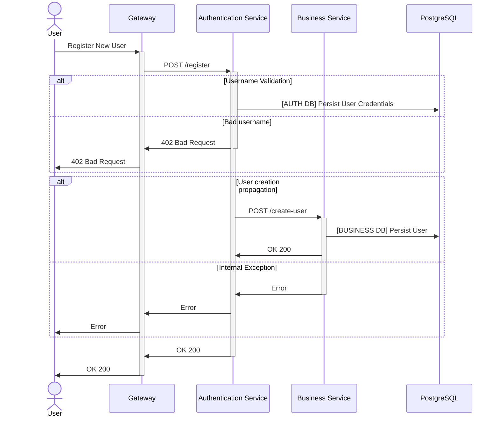
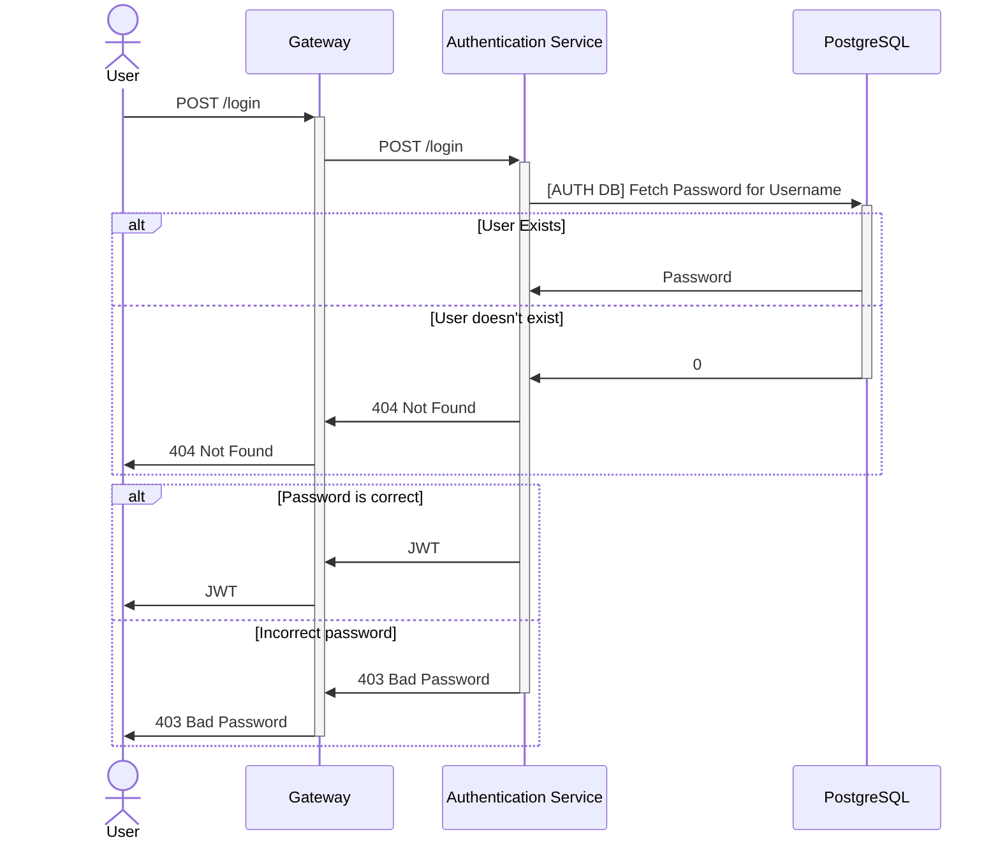
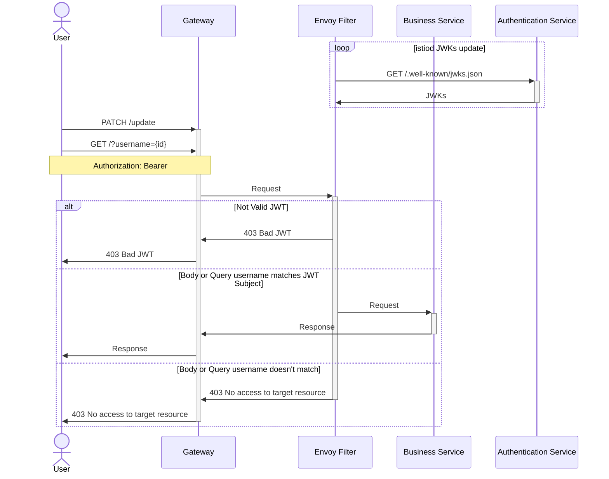
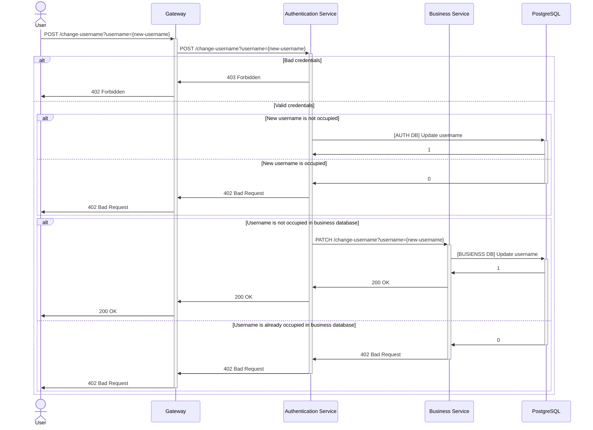
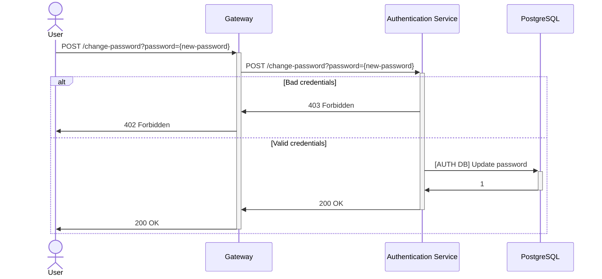

# Otus API Gateway Homework
In this homework I have implemented two key services:
* Authentication Service
* CRUD Service (aka. Business Service)

In my implementation services are highly coupled and Authentication Service
knows a lot about API of the other

Transport protocol: HTTP

Database Access protocol: R2DBC (CRUD) and JDBC (Auth)

Service mesh: Istio


### Installation
1. Install istiod 
```bash
helm repo add istio https://istio-release.storage.googleapis.com/charts
helm repo update
kubectl create namespace istio-system
helm install istio-base istio/base -n istio-system
helm install istiod istio/istiod -n istio-system --wait
```
2. Install istio-ingress
```bash
kubectl create namespace istio-ingress
kubectl label namespace istio-ingress istio-injection=enabled
helm install istio-ingress istio/gateway -n istio-ingress --wait
```
3. Install contents of this folder by running `bootstrap.sh`
4. Check out the API by importing Postman Collection!

**!!!** *EnvoyFilter may not be working due to long startup time of Authentication Service, so feel free to 
`kubectl rollout restart -n istio-system dep/istiod`*

## Sequence Diagrams describing Flow

### Registration



### Login



### Business Service Interactions



## Change username


## Change password
